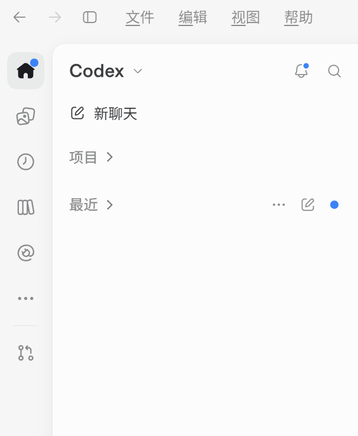

<div align="center">


<br>

[](LICENSE)
[]()
[]()
[](https://github.com/arronfan23/Codex-Chinese/releases/latest)
[](https://github.com/arronfan23/Codex-Chinese/stargazers)

**开启 Codex 桌面版官方内置简体中文界面，一键安装，中英自由切换**

</div>

---

## ✨ 特性

- 🌏 **官方语言包** — 不做第三方翻译，直接开启 Codex 自带的 60+ 语言（含完整简体中文），翻译质量官方保障
- 🖱️ **一键安装** — 双击 `install.cmd`，全程进度条可视化，无需管理员权限，不碰原版安装
- 🔄 **中英自由切换** — 设置 → General → Language，随时切回英文，原版图标/入口完全保留
- 🛡️ **完整性自适应** — 自动适配新版 Electron 的 asar 完整性校验（逐文件 SHA256 + exe 哈希同步）
- 📦 **包身份注入** — 自动适配 MSIX 程序包标识符检查，Store 版 / 官网 MSIX / 官网安装版通吃
- ♻️ **更新自动跟随** — Codex 升级后启动器自动检测版本变化并重新打补丁，零干预

## 📸 效果

<div align="center">

</div>

已实测版本：**26.930.7945.0**（Microsoft Store）、**26.915.4065.0**（官网 MSIX 安装包）。

## 🚀 快速开始

```powershell
git clone https://github.com/arronfan23/Codex-Chinese.git
cd Codex-Chinese
# 双击 install.cmd，或：
powershell -NoProfile -ExecutionPolicy Bypass -File src\install.ps1
```

也可以用网页右上角 **Code → Download ZIP** 下载解压后双击 `install.cmd`。

安装完成后：

1. 用桌面新建的 **「Codex」** 快捷方式启动（指向中文副本，原版开始菜单入口不受影响）；
2. **设置 → General → Language** 选 **中文（中国）**，立即生效。

> 还没装 Codex？[Releases](https://github.com/arronfan23/Codex-Chinese/releases) 中附带了官方
> MSIX 安装包（26.915.4065.0，已实测兼容），也可从 Microsoft Store / 官网安装任意版本。

## 🔧 原理

Codex 桌面版官方自带完整的多语言翻译包（`app.asar` 内含 `zh-CN.json` 等），但多语言开关
`enable_i18n` 被实验开关默认关闭，界面因此永远是英文。本工具做的事：

```
Store/MSIX 版（受保护目录）        官网安装版（可写目录）
        │                                │
        │ 复制可写副本                    │ 直接补丁（自动备份）
        ▼                                ▼
  解包 app.asar ──▶ 开启 enable_i18n ──▶ 重打包（逐文件 integrity 校验哈希）
                          │
        ┌─────────────────┼──────────────────────────┐
        ▼                 ▼                          ▼
  默认语言回退       同步 exe 内嵌的              启动时借用已安装包的
  en → zh-CN       asar 完整性哈希              MSIX 包身份启动副本
```

补丁按**内容**匹配（不依赖带哈希的文件名），混淆变量名随版本变化也能命中；
关键补丁点未命中时会自动提取上下文片段，方便快速适配新版本。

## ⌨️ 命令行（可选）

```powershell
# 只检测，不操作
powershell -NoProfile -ExecutionPolicy Bypass -File "src\install.ps1" -DryRun

# 手动指定安装路径（自动检测失败时）
powershell -NoProfile -ExecutionPolicy Bypass -File "src\install.ps1" -InstallPath "C:\path\to\codex\app"

# 强制重新本地化后启动
powershell -NoProfile -ExecutionPolicy Bypass -File "src\launch.ps1" -ForceUpdate
```

## ❓ 常见问题

| 问题 | 解决 |
|---|---|
| 报 "There is not enough space on the disk" | C 盘空间不足。安装峰值约需「副本大小 + 3× asar」≈ 3~4GB。v1.3.4+ 会在开始前预检并提示缺口；也可用 `setx CODEX_LOCALIZE_ROOT D:\codex-localized` 把工作目录换到其他盘（重开终端生效） |
| 复制时报 "Access to the path ... is denied" | v1.3.3+ 已自动处理：副本后台进程会被按路径完全关闭；若仍失败，多为杀毒软件/勒索软件防护拦截 DLL 写入，放行 `powershell.exe` 后重试 |
| 启动报 "该进程没有程序包标识符" | 旧版本已知问题，使用 v1.2.0+ 重跑 `install.cmd`（自动修复旧副本） |
| 双击后进程一闪而过 | 同上，v1.2.0+ 已适配 asar 完整性校验 |
| Codex 更新后界面回到英文 | 启动器会自动重打补丁；也可手动重跑 `install.cmd` |
| 补丁点未命中 | 安装器会自动打印诊断片段，欢迎提 Issue 附上 |
| 完全卸载 | 删除 `%USERPROFILE%\.codex\codex-localized` 和桌面快捷方式即可，原版不受影响 |

## 📁 目录结构

```
├── install.cmd        # 双击安装
├── launch.cmd         # 手动启动本地化副本
├── docs/images/       # 横幅与实测截图
└── src/
    ├── install.ps1        # 安装器（检测 / 复制 / 补丁 / 完整性同步 / 配置）
    ├── launch.ps1         # 启动器（更新自动跟随 + 包身份注入启动）
    ├── patch-rules.ps1    # 补丁规则库（内容匹配 + 未命中自动诊断）
    ├── asar-util.ps1      # asar 解包 / 打包（纯 .NET：长路径 / 对齐 / 逐文件 integrity）
    └── smo-banner.ps1     # 终端像素字渐变横幅
```

## 📝 更新日志

- **v1.3.1** 桌面快捷方式统一命名为 Codex
- **v1.3.0** 全程进度条（复制 / 解包 / 校验 / 写盘）、终端横幅、README 完善
- **v1.2.0** 修复三大启动障碍：asar 完整性校验（exe 哈希同步 + 逐文件 integrity）、asar 头部对齐、
  MSIX 包身份注入启动；旧副本自动修复
- **v1.1.0** 实测适配 26.915.4065.0（MSIX），Release 附带官方安装包
- **v1.0.0** 首个版本：内容匹配补丁规则、长路径支持

---

## English

**Codex-Chinese** enables the official built-in Simplified Chinese UI of the Codex desktop app
(Microsoft Store / MSIX / EXE editions) with a one-click installer.

- Codex ships 60+ official language packs but keeps `enable_i18n` off by default — this tool flips it on
- Pure PowerShell, no third-party dependencies, no admin rights required, original install untouched
- Handles Electron asar integrity validation (per-file SHA256 + embedded exe hash sync) and MSIX
  package-identity checks automatically
- Switch between Chinese and English anytime in Settings → General → Language

```powershell
git clone https://github.com/arronfan23/Codex-Chinese.git
cd Codex-Chinese
powershell -NoProfile -ExecutionPolicy Bypass -File src\install.ps1
```

## 📄 License

[MIT](LICENSE) © Codex-Chinese contributors. 仅供学习交流，非官方方案；Codex 为 OpenAI 产品，本仓库不包含其任何代码。
